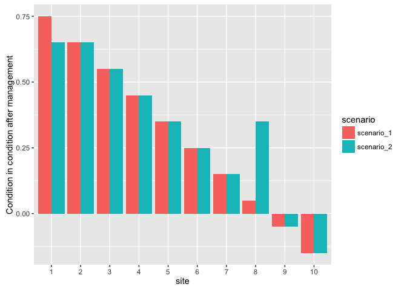

Writing the conference talk was a useful way of distilling the key messages I'd like to communicate in the paper. Below are three that I settled on for the talk.

All work hereafter is copyright of Elise Gould, Libby Rumpff and Peter Vesk and should be cited as Gould, E., Rumpff, L., Vesk, P., (2016, in prep.).

# Key Messages

1. Site performance metrics: matters, influences the decision outcome.

- Don't choose measure for managers
- explore different measures, show to manager, 
- ensure that you capture decision-maker values and attitudes towards risk.

2. Maximising cost-efficiency on a site-by-site basis not always optimal.

- depends on budget, 
- explore further with sensitivity analysis under varying budgets, but lower than I have explored.

3. When using multiple, coupled models, particularly with the process-model / decision-model approach under SDM, be cognisent of the fact that there may be critical uncertainties: uncertainty in the process model affects the optimal decision, and may interact with particularities in the decision model to result in strange decision outcomes.

- effects of process-model uncertainty on the decision-model should always be explored in this framework.
- Decision-models should be reviewed, in addition to process-models being reviewed.

# Interpreting the results, and synthesis

I didn't have room to explore this in my ESA talk, but there are two important questions to be asked of the results.

1. Why did the frontier approach result in better outcomes at the portfolio level than the site-by-site approaches?

This is important, particularly for other applications of this problem. There are several elements of the system that interact with the decision-model to result in this outcome:

- The effectiveness of an action depends on initial condition
- There are decreasing marginal gains with increasing initial condition, BUT the action costs the same.
- More effective actions are usually more costly.

The global searching is able to balance trade-offs between acting not just at different sites, but between acting *differently* at different sites. This is a consequence of the fact that the frontier approach actually ends up searching a larger portion of the decision space thatn the site-by-site allocation algorithms.

The site-by-site algorithms performed so poorly because the number of action-sets able to be afforded after each site was acted at, became increasingly, and quickly smaller / depleted. Often by tghe 7th / 8th site, no more actions could be afforded.

Thinking back to the underlying dynamics. Let's take the example of the case where we have a distribution of condition among 10 sites, and we rank them from best to worst in order of marginal change in condition. Now if we take the site with the greatest gain in condition, and decide to forego a little bit of benefit at that site by choosing a slightly less effective action-set, and instead allocating this effort ($) at a site where most action-sets were unable to be afforded, you will most-likely see a larger marginal gain in condiiton there, for the same cost. Resulting in a greater overall portfolio score. So that goes partly towards explaining the mechanics behind the greater performance of the 

```{r mock-plot}
library(tidyverse)
library(magrittr)
site_condition <- data_frame(site = factor(x = c(10:1), ordered = TRUE), delta_condition = seq(from = -0.15, to = 0.75, by = 0.1), scenario = "scenario_1")

site_condition %<>% 
        bind_rows(., site_condition %>% 
                          dplyr::mutate(delta_condition = ifelse(site == 8, delta_condition + 0.3, delta_condition),
                                         delta_condition = ifelse(site == 1, delta_condition - 0.1, delta_condition),
                                         scenario = "scenario_2"))


site_condition %>%
        ggplot(aes(y = delta_condition, x = site, fill = scenario)) +
        geom_bar(stat = "identity", position = "dodge") +
        labs(y = "Condition in condition after management")


```



From the plot above, I've generated a mock-plot of two decision-outcomes and their resultant portfolios. I've plotted the condition of each site after management for each one. Under scenario 1 we've allocated on a site-by-site basis (the method of allocation doesn't matter for now). Now imagine if we could forego some benefit at our best site (site 1) after management and allocate this effort at site 8 instead (scenario 2). Because the benefit of management depends on the initial condition of the site, you can obtain more marginal benefit at the site in lower condition, than at a site in higher condition. So when you measure, say, the average condition across all of the sites, it is greater under scenario 2 than under scenario 1. Imagine scenario 2 is more like the frontier + optimisation approach.

2. Why did the site-by-site cost-effective approach underperform (vs. expectation / other's results e.g. PPP)?

Similar underlying processes of the system coupled to decision-making...

- decreasing marginal gains with increasing initial condition means that large benefits were often foregone, even if you could afford to allocate further effort at a site.
- Interactions with underlying process-model: model-uncertainty that propagated through time conflted with the metric of condition, coupled to the above dynamic, meant that acting at best sites was always penalised - best sites always 'declined in condition', worst sites always 'gained in condition', Always really expensive to act at best sites, and resulted in a small value of management, because marginal gains very expensive at the upper end of initial condition. Cost-efficiency maximisation at the site-scale always penalised acting there.

## Are there other ways of solving this problem?

Chatted to JM and IC after my talk. Both suggested different ways of approaching this problem, that perhaps lead to more optimal decision outcomes.

1. SDP: This is essentially a Markove decision process problem. (Management is dependent on the state of the system, and resources are constrained). She also questioned the notion of why the transitions are different from one year to the next. Need a good ecological reason for this. She drew an influence diagram for the problem, including one that can incorporate different transitions in one year to the next. Could be interesting to look at this approachand compare it to the frontier analysis.
2. Delimit action-sets with marginal cost-efficiency and use new optimisation software. Approach is able to solve this knapsack problem (i.e. each knapsack has its own pool of actions to choose from) with a heuristic optimisation algorithm. Potentially results in much more of the decision space being searched.

# Follow up tasks:

1. Review the cons. planning and prioritisation literature - can we bring our findings to bear on this? I think the point about the site-by-site approaches being weaker than global optimisations (even if they are heuristic) is a good one to follow up, particularly because there are still papers out there advocating this parcel-based additive approach. It could be also good to delve into the off-setting realm, because I think this is a really similar problem, particularly when they are aiming to incorporate condiiton at the 'program' and the 'region' level into the decision-making (i.e. incorporating the benefit / effects of not offsetting / acting at sites in the region, which is what we did when choosing 'not to act' at some sites).

2. Temporal uncertainty and probabilities of transition changing through time. One thing IC brought up is that, it may not be sensical to have different transitions from year to the next. Might need a good ecological reason to justify this specification of the system model. From memory, we talked about this with PV, and he seemed to be of the opininion that this is okay (i.e. as it stands the probabilities become increasingly uncertain with time, for a given node in the model). His reasoning being that, well, the further we project into the future, the more uncertain we are about the state of the grassland. I.e. there is increasing uncertainty the further we project into the future.  There is certainly truth to that statement, so I think we should discuss this further. But, if we assume that the manager is collecting data on the state of the system each year (which, they should be), should that uncertainty that propagates through time be removed? At the time of making the projections, we are still more and more uncertain if looking three years into the future, for example.
